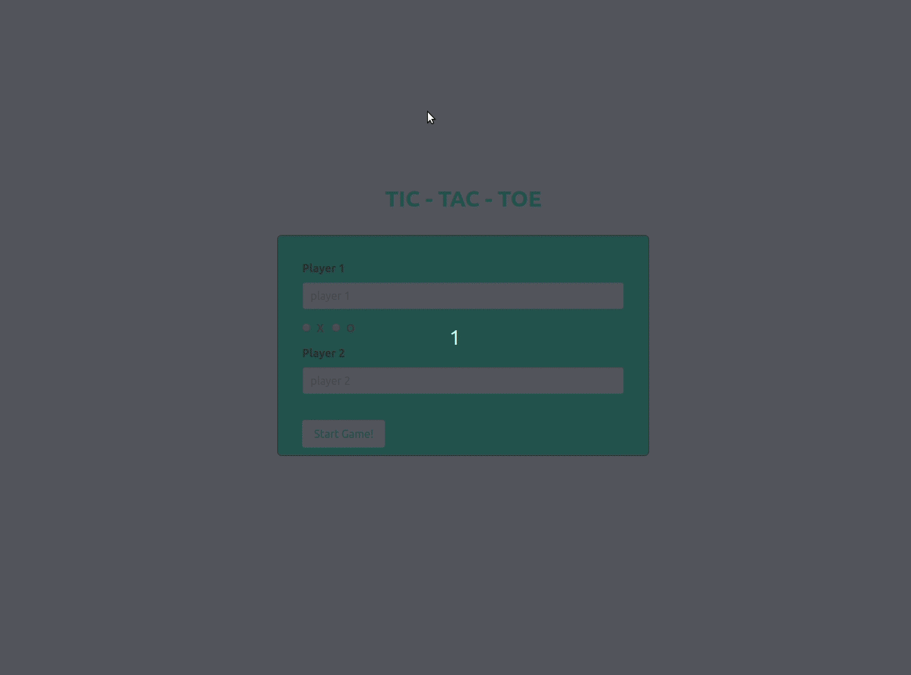

JS-Tic-Tac-Toe
==============
Microverse Tic-Tac-Toe implemented with JS factory functions and inheritance pattern design

Have fun losing hours playing on our Tic-Tac-Toe gameboard the times you want. Register your name and go.

### Built with

- JS
- CSS/Bulma
- HTML
- Webpack
- JEST


## Live Version
Here: [click](https://raw.githack.com/ricardovaltierra/JS-Tic-Tac-Toe/js-pattern-design/index.html)

## Usage
### Register and playing


### Make a tie and play a new game


You can clone the repo and run over your personal server.

<!-- GETTING STARTED -->

## Getting Started

To get a local copy up and running follow these simple steps.

Clone or fork the <a href="https://github.com/redacuve/to-do-js">repo</a> [git@github.com:redacuve/to-do-js.git]

*note you need have install npm or yarn
* [npm](https://www.npmjs.com/get-npm)
* [yarn](https://classic.yarnpkg.com/en/docs/install)

<!-- JEST TEST -->
## How it Works

This webpage is built with pure Javascript, it needs webpack to proper use because has various imports of code, it has his own classes, and it has various little helper functions, all of the .js files are located inside /src folder and jest files on test/.

### Running the code

*   Navigate to the root directory of the project

*   Run this command on your terminal to add all the required packages and dependencies
    ```
    $ npm install
    ```
*   Also, you can build this webpage for production, this app it's going to be saved inside the /dist folder, here we can see a main.js file, this is a minified file of the previous files thar are located inside /src folder.
    ```
    $ npm run build
    ```
*   Now the app is ready, you can open the index.html inside /dist folder.

### Running test suites

*   Type the above command with `.` to all test suites or specify one with `test/test_file.js`
    ```
    $ npm run test ( . || test_file )
    ```
*   Now that all of your test succeed, you can refactor the libraries to your convenience ant testing them to see if they work!


## 🤝 Contributing

Contributions are more than welcome!<br/>Feel free to check [issues page](https://github.com/ricardovaltierra/JS-Tic-Tac-Toe/issues).


1. Fork (https://github.com/ricardovaltierra/JS-Tic-Tac-Toe/fork)
2. Create your working branch (git checkout -b [branch_name])
3. Commit your changes (git commit -am 'what you will add or fix or improve')
4. Push (git push origin [branch_name])
5. Create a PR

## 🤖 Contributor

Rey David Cuevas - [GitHub](https://github.com/redacuve)
<br>
Ricardo Valtierra - [GitHub](https://github.com/ricardovaltierra)

## 🙋‍♂ Support :)

Give a ⭐️ if you liked it!

## 📝 License

This project is under the [MIT](LICENSE) license.